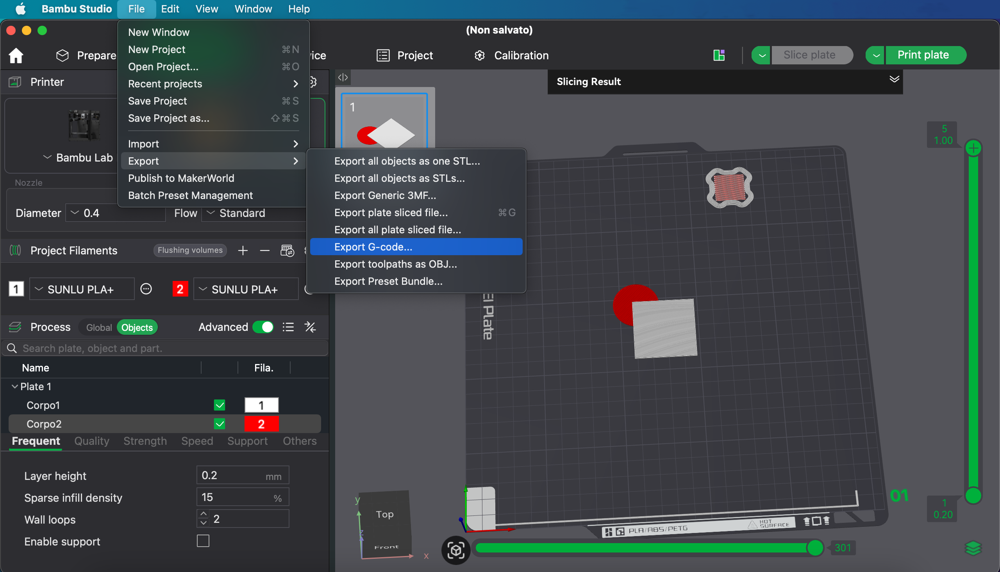

# ManualAMS

A small tool that automatically adds pauses in G-code whenever Bambu Studio inserts AMS color change commands — enabling multi-color prints without an AMS.

## Table of Contents
- [How the Program Works](#how-the-program-works)
- [Generating the G-code in BambuLab](#generating-the-g-code-in-bambulab)

---

## How the Program Works

ManualAMS scans your G-code files for the AMS color change commands that Bambu Studio inserts and automatically injects a **pause command (`M400 U1`)** before each occurrence.  

This allows users **without an AMS** to manually change filament during multi-color prints, making multi-color printing accessible on any printer.

**Steps:**
1. Open the program and select the G-code file you want to modify.  
2. Press **Start** to apply the automatic pauses.
3. Save the modified G-code.
4. Print your model, performing manual filament swaps at each pause.

After modification, every time the printer would normally perform an AMS filament change, **you will need to manually unload the old filament and load the new one**.

---

## Generating the G-code in BambuLab

To use ManualAMS effectively, you need a G-code file generated by Bambu Studio with AMS color changes:

1. Open Bambu Studio.
2. Load your multi-color model.
3. Configure the colors as usual, even if you do not have an AMS.
4. Export the G-code to your computer.
5. Open the exported G-code with ManualAMS to insert the necessary pauses for manual filament changes.  

